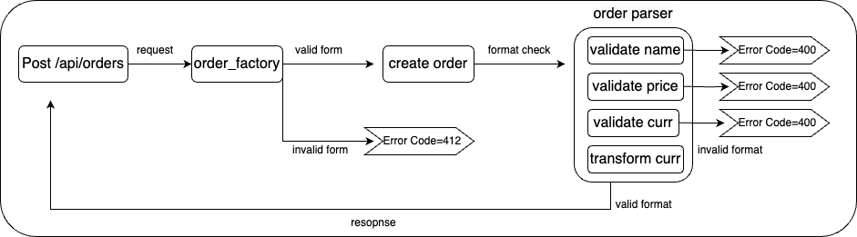

# AsiaYo API OA

## Description
This project implements a RESTful API using FastAPI to handle orders and Pyspark to process data. 


## Features

- **FastAPI**: Built with FastAPI to ensure high performance and easy development.
- **Data Processing**: Integrates PySpark for efficient data processing and analytics.
- **Docker Support**: Dockerized application for easy deployment and scaling.

## Data Type

  ### Input Fields

| Field     | Type   | Example                |
|-----------|--------|------------------------|
| id        | String | "A0000001"             |
| name      | String | "Melody Holiday Inn"   |
| address   | Object | { "city": "taipei-city", "district": "da-an-district", "street": "fuxing-south-road" } |
| price     | String | "2050"                 |
| currency  | String | "TWD"                  |

### Address Object Fields

| Field     | Type   | Example                |
|-----------|--------|------------------------|
| city      | String | "taipei-city"          |
| district  | String | "da-an-district"       |
| street    | String | "fuxing-south-road"    |

## Workflow


1. A request is sent to the `POST /api/orders` endpoint.

2. The request is handled by the `order_factory`, which checks if the form is valid:
   - If valid, it proceeds to create the order.
   - If invalid, it returns an `Error Code=412`.
3. The `order parser` validates the order:
   - Validates the name, price, and currency.
   - Transforms the currency if needed.
   - If any validation fails, an `Error Code=400` is returned.


## Installation

To set up the project locally, follow these steps:

1. Clone the repository:
   ```bash
   git clone https://github.com/benson-lu518/API_OA_AsiaYo.git
   cd API_OA_AsiaYo/app 

2. Build Docker Image
   ```bash
   docker build . -t asiayo-fastapi:latest

3. Run Docker container
   ```bash
   docker run -p 8000:8000 asiayo-fastapi
   
## SOLID Principles and Design Patterns

### SOLID Principles

- **Single Responsibility Principle**:  
  Each class (order_factor, order_factor) is responsible for a single part of the functionality (order).

- **Open/Closed Principle**:  
  New features can be added without modifying the existing code (Ex: new parser, new validator, etc.).

- **Liskov Substitution Principle**:  
  All base types can be replaced by subtypes without affecting the rest of the system.
  Since this program is simple and no inherited methods are implemented it opens to scale up for future parsers or validators.

- **Interface Segregation Principle**:  
  Interfaces are kept lean and focused, ensuring classes are not forced to implement unnecessary methods.
  Since this program is simple and no interface methods are implemented it opens to scale up for future parsers or validators.

- **Dependency Inversion Principle**:  
  High-level modules should not depend upon low-level ones; use abstraction
  Since this program is simple and no inherited methods are implemented it opens to scale up for future parsers or validators.


### Design Patterns

- **Factory Pattern**:  
  Used to create an order instance through the `OrderFactory` class.
  Since this program is simple it can be scaled up for future different orders as base type or sub type.  

- **Strategy Pattern**:  
  Implemented in the validation process, allowing different strategies (validators) for validating order fields (e.g., `validate_name`, `validate_price`, `validate_currency`).
  Since the input data is simple it can be scaled up for future different input data that needs to implement different particular validators if it's needed.
